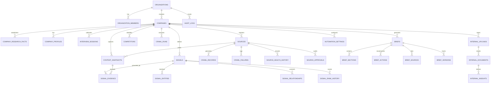

# Signal Stack — Entity Relationship Diagram (ERD)

```mermaid
erDiagram
    ORGANIZATIONS ||--o{ ORGANIZATION_MEMBERS : has
    ORGANIZATIONS ||--o{ COMPANIES : monitors
    ORGANIZATIONS ||--o{ AUDIT_LOGS : tracks
    
    COMPANIES ||--o{ COMPANY_RESEARCH_FACTS : establishes
    COMPANIES ||--o{ COMPANY_PROFILES : has
    COMPANIES ||--o{ INTERVIEW_SESSIONS : calibrates
    COMPANIES ||--o{ SOURCES : registers
    COMPANIES ||--o{ COMPETITORS : identifies
    COMPANIES ||--o{ CRAWL_RUNS : executes
    COMPANIES ||--o{ CONTENT_SNAPSHOTS : captures
    COMPANIES ||--o{ SIGNALS : detects
    COMPANIES ||--o{ BRIEFS : generates
    COMPANIES ||--o{ INTERNAL_UPLOADS : ingest
    COMPANIES ||--o{ AUTOMATION_SETTINGS : configures
    
    SOURCES ||--o{ CRAWL_RECORDS : generates
    SOURCES ||--o{ CRAWL_FAILURES : logs
    SOURCES ||--o{ CONTENT_SNAPSHOTS : yields
    SOURCES ||--o{ SOURCE_HEALTH_HISTORY : records
    SOURCES ||--o{ SOURCE_APPROVALS : audits
    
    SIGNALS ||--o{ SIGNAL_EVIDENCE : grounded_by
    SIGNALS ||--o{ SIGNAL_ENTITIES : mentions
    SIGNALS ||--o{ SIGNAL_RELATIONSHIPS : connects
    SIGNALS ||--o{ SIGNAL_RANK_HISTORY : scores
    
    CONTENT_SNAPSHOTS ||--o{ SIGNAL_EVIDENCE : excerpts
    
    BRIEFS ||--o{ BRIEF_SECTIONS : contains
    BRIEFS ||--o{ BRIEF_ACTIONS : recommends
    BRIEFS ||--o{ BRIEF_SOURCES : cites
    BRIEFS ||--o{ BRIEF_VERSIONS : tracks
    
    INTERNAL_UPLOADS ||--o{ INTERNAL_DOCUMENTS : chunks
    INTERNAL_DOCUMENTS ||--o{ INTERNAL_INSIGHTS : derives
```
